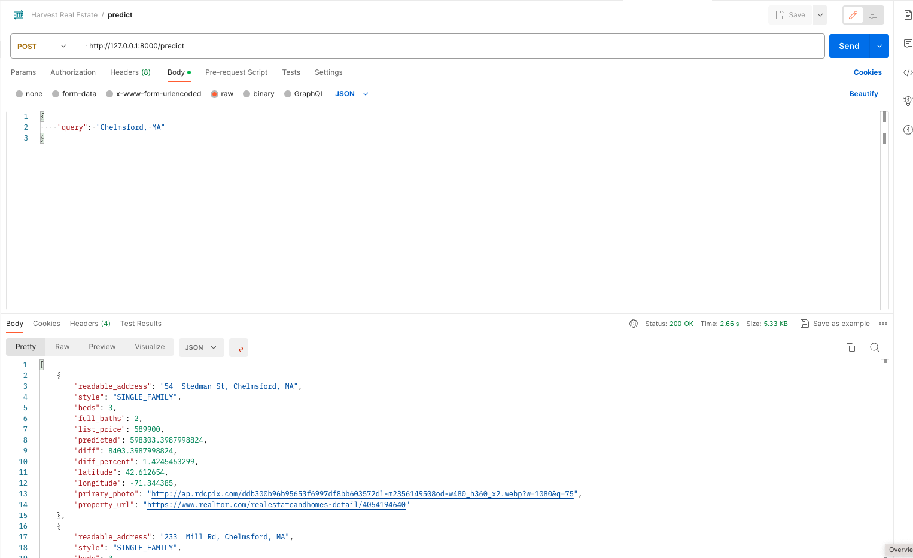

Harvest predictions
---

Finds good value properties based off realtor.com data

### How to run

#### Notebook

Install dependencies in virtual env using standard process.

`redfin_harvest.ipynb`.

Update `TARGET_LOCATION` (or any of the other parameters in `RedfinModel`), run notebook.

#### Client

<pre>
cd ./harvest-ai
yarn
yarn dev
</pre>

The app should now be running on port 3000.

#### Server
<pre>
  pip install -r
  uvicorn main:app --reload
</pre>

Deployment
https://ahmadrosid.com/blog/deploy-fastapi-flyio

`fly deploy`

### Example screenshot

### Useful links
* Finding dependencies: https://github.com/bndr/pipreqs
